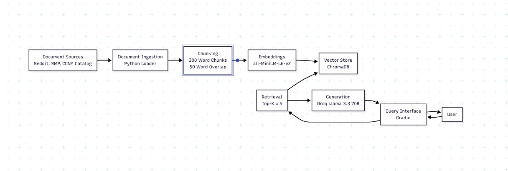

# Project 1 Planning: The Unofficial Guide

---

## Domain

CCNY Computer Science Professor Reviews and Course Advice

This project focuses on student-generated reviews and discussions 
about CCNY computer science professors and courses. While official 
course descriptions explain what a course covers, they often do not 
provide information about teaching style, workload, grading policies, 
exam difficulty, or student experiences. The goal is to make this 
unofficial knowledge searchable so students can make more informed 
academic decisions.

---

## Documents

| # | Source | Description                                                                        | URL or location                                                                                 |
|---|--------|------------------------------------------------------------------------------------|-------------------------------------------------------------------------------------------------|
| 1 | Reddit | How is CCNY when it comes to CS?                                                   | https://www.reddit.com/r/CCNY/comments/1fdtv3f/how_is_city_college_when_it_comes_to_computer/                          |
| 2 | Quora  | Does CCNY have a good CS program?                                                  | https://www.quora.com/Does-The-City-College-of-New-York-CCNY-have-a-good-computer-science-program-for-undergraduates |
| 3 | CCNY   | CCNY CS Research                                                                   | https://www.ccny.cuny.edu/compsci/research?srsltid=AfmBOoqUmFRGYedfufFAEt4HYj4jqxwBVnV4OJqSMr2Z8I7jvAeZ0ykl                             |
| 4 | Reddit | What is CCNY really like in terms of professors, classes, course load, and grading? | https://www.reddit.com/r/CCNY/comments/1l47u0u/what_is_ccny_really_like_in_terms_of_professors/ |
| 5 | Reddit | Is City College (CCNY) seriously that bad?                                         |  https://www.reddit.com/r/CUNY/comments/1b501o0/is_city_college_ccny_seriously_that_bad/                                                                                               |
| 6 | RMP    | Michael Grossberg CCNY                                                             |  https://www.ratemyprofessors.com/professor/854471                                                                                               |
| 7 | RMP    | Douglas Troeger CCNY                                                               |   https://www.ratemyprofessors.com/professor/432142                                                                                          |
| 8 | RMP    | CCNY Professors                                                                    |  https://www.ratemyprofessors.com/school/224                                                                                               |
| 9 | RMP    | William Skeith                                                                     |  https://www.ratemyprofessors.com/professor/1316015                                                                                             |
| 10 | CCNY   | CCNY Computer Science Catalog                                                      |  https://ccny-undergraduate.catalog.cuny.edu/programs/CMPSC-BS                                                                                               |

---

## Chunking Strategy

**Chunk size: 200 words**

**Overlap: 50**

**Reasoning: Most documents consist of short professor reviews, 
    discussion posts, and course descriptions. Initial testing with 
    300-word chunks produced only 18 chunks across the corpus, which 
    reduced retrieval granularity. Reducing the chunk size to 200 words
    increased the total number of chunks to 31 while preserving sufficient 
    context through a 50-word overlap. This provides more precise 
    retrieval of information about professors, grading policies, 
    workloads, and student experiences.**

---

## Retrieval Approach

**Embedding model:all-MiniLM-L6-v2**

**Top-k: 5**

**Production tradeoff reflection: For a production system, I would consider
    larger embedding models that provide higher retrieval accuracy and stronger 
    support for longer contexts or multiple languages. However, larger models 
    increase latency, storage requirements, and computational cost. The all-MiniLM-L6-v2 
    model provides a good balance between retrieval quality and efficiency for 
    this project’s relatively small corpus.**

---

## Evaluation Plan

| # | Question                                                                                                  | Expected answer                                                                                                                                                   |
|---|-----------------------------------------------------------------------------------------------------------|-------------------------------------------------------------------------------------------------------------------------------------------------------------------|
| 1 | What do students say about Professor Grossberg’s exams?                                                   | Reviews commonly describe his exams as challenging but fair and emphasize understanding concepts rather than memorization.                                        |
| 2 | According to student discussions, what preparation is recommended before taking Algorithms at CCNY?       | Students recommend having a strong understanding of data structures and consistent problem-solving practice before taking Algorithms.                             |
| 3 | How to do well in Troeger's or Gertner's class?                                                           | Students frequently recommend staying on top of coursework, reviewing lecture material regularly, and seeking clarification early when concepts become difficult. |
| 4 | What workload concerns do students mention most frequently when discussing CCNY computer science courses? | Students frequently mention heavy workloads, difficult assignments,challenging exams, and significant time commitments in upper-level computer science courses.   |
| 5 | Based on student reviews, what factors contribute most to a professor receiving positive ratings?         | Positive ratings are commonly associated with clear explanations, fair grading, organized lectures, and helpful feedback.                                         |

---

## Anticipated Challenges

1.    Student reviews may contain conflicting opinions about the same professor or course. 
      One student may describe a professor as helpful while another may describe the same
      professor as difficult, making it challenging to generate balanced answers.

2.     Retrieval may return irrelevant or incomplete chunks because discussions often 
       cover multiple topics in the same post. Important information about a professor or 
       course could be split across chunk boundaries, causing the system to miss relevant 
       context.

---

## Architecture

---

## AI Tool Plan

I will use Claude Code as my primary AI tool throughout this project.

I will provide Claude Code with sections from this planning document, 
including my domain description, document sources, chunking strategy, 
retrieval approach, and architecture diagram. I will use it to generate
code for document ingestion, chunking, embeddings, retrieval, grounded 
response generation, and the query interface.

I expect Claude Code to produce Python code that follows the requirements
defined in this specification. To verify the output, I will compare the 
generated implementation against my planned chunk size, overlap, embedding 
model, retrieval settings, and evaluation criteria. I will also test the 
system using my evaluation questions to ensure the behavior matches the 
design described in this document.

**Milestone 3 — Ingestion and chunking:**

I will use Claude Code to generate Python code that loads my collected 
documents, cleans the text, and splits it into 200-word chunks with a 
50-word overlap. I will provide the Domain, Documents, and Chunking 
Strategy sections from this planning document and verify that the 
generated code follows my specified chunking approach.

Results:
After ingestion and chunking, the corpus consisted of 10 source documents
and 31 chunks. Diagnostic testing showed no HTML artifacts, no boilerplate text issues, 
and all chunks passed quality validation checks. Sample chunk inspection confirmed 
that chunks remained self-contained and preserved meaningful context about
professors, courses, workload, grading, and student experiences.

**Milestone 4 — Embedding and retrieval:**

I will use Claude Code to implement embeddings using the all-MiniLM-L6-v2 model 
and store them in ChromaDB. I will provide the Retrieval Approach section and
architecture diagram as input. I will verify the implementation by testing 
queries and checking that the top 5 retrieved chunks are relevant to the user’s question.

Status: COMPLETE

- Embedded 31 document chunks using all-MiniLM-L6-v2
- Stored embeddings in ChromaDB collection
- Implemented semantic retrieval
- Tested retrieval with professor-specific and curriculum-related queries
- Verified top-k retrieval returns relevant sources

**Milestone 5 — Generation and interface:**

I will use Claude Code to connect retrieval to a language model through 
Groq and build a Gradio interface for user queries. I will provide the 
project requirements and architecture diagram as input. I will verify 
the output by ensuring responses are grounded in retrieved documents, 
include source attribution, and correctly handle questions that are not
covered by the documents.